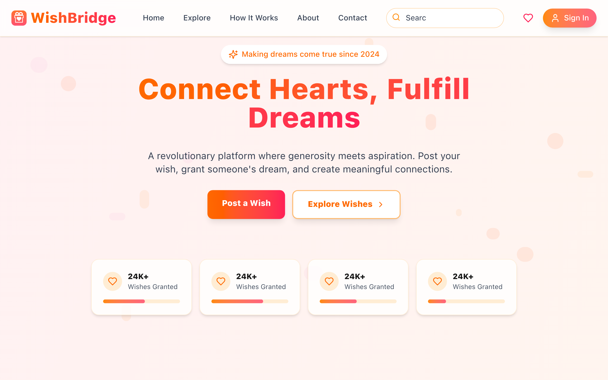
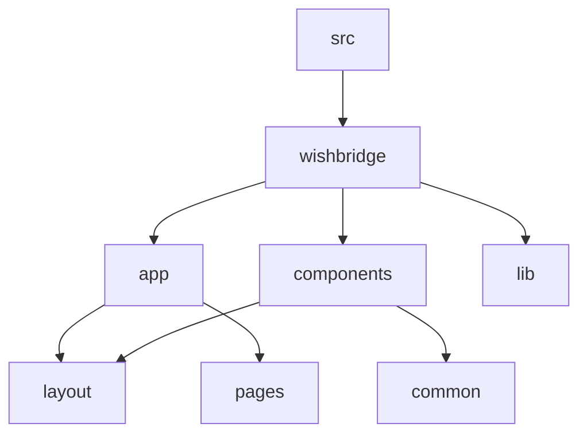

# Wish Bridge: Empowering Wishes, Connecting Communities 🌟

## 🗂️ Description

Wish Bridge is a web application designed to facilitate wish fulfillment and community support. The platform allows users to create and manage wishes, connect with others, and track progress. This project aims to provide a seamless and engaging experience for users, leveraging modern web technologies and a robust tech stack.

## ✨ Key Features

### 🌈 Core Features

* **Wish Management**: Create, edit, and manage wishes with ease
* **Community Support**: Connect with others, receive support, and fulfill wishes
* **Authentication**: Secure authentication system using Firebase
* **Profile Management**: Manage user profiles and track progress

### 📈 Additional Features

* **Wallet**: Buy tokens and view balance
* **Contact**: Send messages and view contact information
* **How It Works**: Detailed explanation of the wish creation process and platform functionality

## 🗂️ Folder Structure

## 🛠️ Tech Stack

## ⚙️ Setup Instructions

To run the project locally, follow these steps:

* Git clone the repository: `https://github.com/Tiyasa-Mukherjee/Wish-Bridge.git`
* Install dependencies: `npm install` or `yarn install`
* Start the development server: `npm run dev` or `yarn dev`

## 📝 Configuration

The project uses various configuration files:

* `wishbridge/next.config.ts`: Configures Next.js settings
* `wishbridge/tailwind.config.js`: Configures Tailwind CSS settings
* `wishbridge/eslint.config.mjs`: Configures ESLint settings
* `wishbridge/tsconfig.json`: Configures TypeScript settings

## 🤖 GitHub Actions

The project uses GitHub Actions for continuous integration and deployment. The workflow is defined in `.github/workflows/main.yml`.

## 📁 Code Structure

The codebase is organized into the following directories:

* `wishbridge/app`: Contains page components and layout
* `wishbridge/components`: Contains reusable components
* `wishbridge/lib`: Contains utility functions and Firebase configuration
* `wishbridge/context`: Contains context API definitions

## 🔒 Security

The project uses Firebase Authentication for secure authentication and authorization. Sensitive data is stored securely using Firebase Firestore and Storage.

  

<h3>Tiyasa Mukherjee</h3>

No information provided.

 

  <a href="https://gitfull.vercel.app">Made by GitFull</a>

    